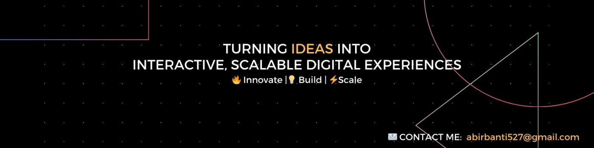

<h1 align="center">Hi 👋, I'm Abir Das</h1>
<h3 align="center">A passionate Software developer from India, Learning MERN Stack and Looking for opportunities</h3>

<!-- LinkedIn / header banner image -->

- 📫 How to reach me: abirbanti527@gmail.com / devabir@hotmail.com

<h3 align="left">Connect with me:</h3>

  
  
  
  

<h3 align="left">Languages and Tools:</h3>

  <!-- Java -->
  

  <!-- Spring Boot -->
  

  <!-- Kafka -->
  

  <!-- Kubernetes -->
  

  <!-- Hibernate -->
  

  <!-- Kotlin -->
  

  <!-- JavaScript -->
  

  <!-- React -->
  

  <!-- HTML -->
  

  <!-- CSS -->
  

  <!-- Tailwind CSS -->
  

  <!-- Bootstrap -->
  

  <!-- Express -->
  

  <!-- Node.js -->
  

  <!-- MongoDB -->
  

  <!-- PHP -->
  

  <!-- SQL -->
  

  <!-- Git -->
  

  <!-- Google Cloud -->
  

  <!-- AWS -->
  

 

  &nbsp;
  

  

