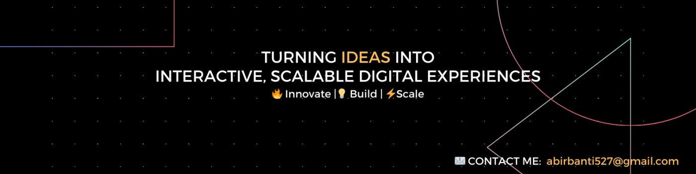

  

<!--  -->

 

&nbsp;

---

<h1 align="center">Hi 👋, I'm Abir Das</h1>
<h3 align="center">A passionate Software Developer from India, Learning Spring & MERN and Looking for opportunities</h3>

<!-- LinkedIn / header banner image -->

- - 📫 How to reach me: abirbanti527@gmail.com / devabir@hotmail.com

## 🌐 Connect with me :

  

<!-- Snake Game Repo View -->

  

# 💻 Tech Stack:

                

     
 

## 📊 GitHub Stats

  

---

## 📈 Most Used Languages

  
  

---

## 🏆 GitHub Achievements

  
  
  
  

---

<!-- 

  

 -->

## ✍️ Dev Quote

“It's fine to celebrate success, but it is more important to heed the lessons of failure.”

— Bill Gates

---

## 👀 Profile Views

  

---

## 🚀 Current Focus

- 🔥 Building **Full Stack Projects (Spring Boot + React)**
- 📚 Practicing **DSA daily**
- 🧠 Learning **System Design & Scalable Architecture**

---

## 💡 Fun Fact

⚡ I enjoy solving DSA problems and turning ideas into real-world applications 🚀

  

  

